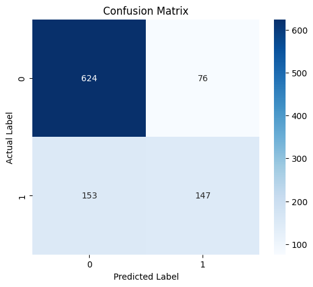
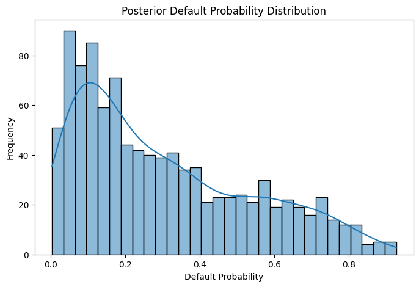
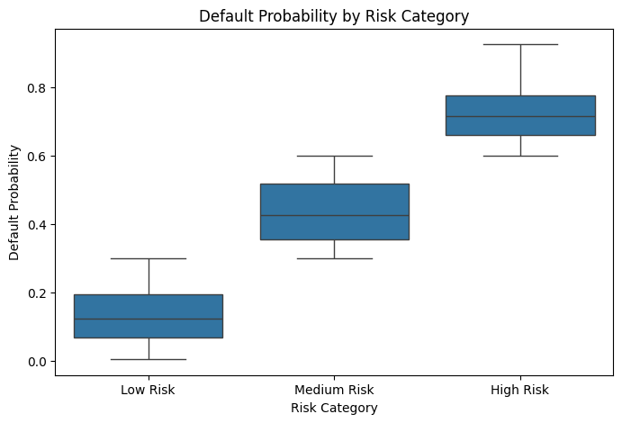

# Bayesian Credit Risk Simulator

## Overview

The Bayesian Credit Risk Simulator is a probabilistic financial risk analytics project designed to estimate borrower default risk using Bayesian logistic regression.

Unlike traditional deterministic machine learning approaches, this project explicitly models uncertainty in borrower risk estimation using Bayesian inference and Markov Chain Monte Carlo (MCMC) sampling.

The project demonstrates applications of:

- Bayesian Statistics
- Computational Statistics
- Financial Risk Analytics
- Predictive Modeling
- Uncertainty Quantification
- Probabilistic Decision Systems

---

# Project Motivation

Credit risk modeling plays a critical role in modern financial systems. Traditional classification approaches often provide point predictions without capturing uncertainty in parameter estimation and borrower risk.

This project explores how Bayesian inference can improve interpretability and uncertainty-aware decision-making in financial lending analytics.

The objective is to build a reproducible probabilistic framework capable of:

- estimating borrower default probabilities,
- quantifying predictive uncertainty,
- and supporting interpretable risk segmentation.

---

# Dataset

The project uses the German Credit Dataset from the UCI Machine Learning Repository.

Dataset characteristics:

- 1000 borrower observations
- 20 financial and demographic predictor variables
- Binary credit risk outcome

Target variable:

| Value | Meaning |
|---|---|
| 0 | Good Credit |
| 1 | Bad Credit |

Dataset source:
https://archive.ics.uci.edu/ml/datasets/statlog+(german+credit+data)

---

# Repository Structure

```text
bayesian-credit-risk-simulator/
│
├── data/
│   └── raw/
│
├── notebooks/
│   ├── 01_data_exploration.ipynb
│   ├── 02_data_preprocessing.ipynb
│   ├── 03_bayesian_modeling.ipynb
│   ├── 04_risk_analysis.ipynb
│   └── 05_model_evaluation.ipynb
│
└── README.md
```

---

# Workflow

The project follows a structured analytical pipeline:

## 1. Exploratory Data Analysis
- borrower risk distribution analysis,
- financial variable exploration,
- statistical visualization,
- and portfolio risk interpretation.

## 2. Data Preprocessing
- categorical variable encoding,
- target transformation,
- feature scaling,
- and modeling matrix preparation.

## 3. Bayesian Logistic Regression
The Bayesian model estimates posterior borrower default probabilities using probabilistic inference.

The logistic model is defined as:

\[
P(Y=1)=\frac{1}{1+e^{-(\alpha+X\beta)}}
\]

where:

- \(Y=1\) represents bad credit risk,
- \(X\beta\) represents borrower characteristics,
- \(\alpha\) is the intercept term.

Posterior estimation is performed using Markov Chain Monte Carlo (MCMC) sampling with PyMC.

## 4. Probabilistic Risk Analysis
The project generates:
- posterior default probabilities,
- borrower risk scores,
- and risk category segmentation.

## 5. Model Evaluation
Model performance is evaluated using:
- accuracy,
- confusion matrix,
- classification report,
- ROC-AUC analysis,
- and probabilistic interpretation.

---

## Project Visualizations

### Confusion Matrix



The confusion matrix summarizes classification performance by comparing predicted and actual borrower credit outcomes.

---

### Posterior Default Probability Distribution



The posterior distribution illustrates the uncertainty-aware probability estimates generated through Bayesian inference.

---

### Risk Category Segmentation



Borrowers are segmented into risk categories using posterior default probabilities, supporting interpretable lending decisions.

---

### ROC Curve


The ROC curve evaluates the model’s ability to distinguish between high-risk and low-risk borrowers across classification thresholds.


# Technologies Used

- Python
- PyMC
- ArviZ
- NumPy
- pandas
- scikit-learn
- matplotlib
- seaborn
- Google Colab

---

# Key Features

- Bayesian logistic regression
- Uncertainty-aware prediction
- MCMC posterior estimation
- Probabilistic borrower risk scoring
- Financial risk segmentation
- Statistical visualization
- Research-oriented workflow

---

# Example Analytical Outputs

The project includes:
- posterior probability distributions,
- confusion matrices,
- ROC curves,
- borrower risk segmentation plots,
- and probabilistic financial risk analysis.

---

# Research Significance

This project demonstrates how Bayesian inference can support interpretable and uncertainty-aware financial decision systems.

The workflow reflects real-world applications in:
- credit scoring,
- banking analytics,
- financial forecasting,
- and probabilistic risk management.

---

# Future Improvements

Potential future extensions include:

- hierarchical Bayesian modeling,
- Bayesian neural networks,
- macroeconomic feature integration,
- explainable AI techniques,
- real-time risk monitoring,
- and deployment as an interactive dashboard.

---

# Conclusion

This project demonstrates a complete end-to-end Bayesian financial risk analytics workflow, including:

- data preprocessing,
- probabilistic modeling,
- uncertainty quantification,
- predictive evaluation,
- and financial interpretation.

The repository highlights practical applications of Bayesian statistics and computational finance in modern credit risk analytics.
